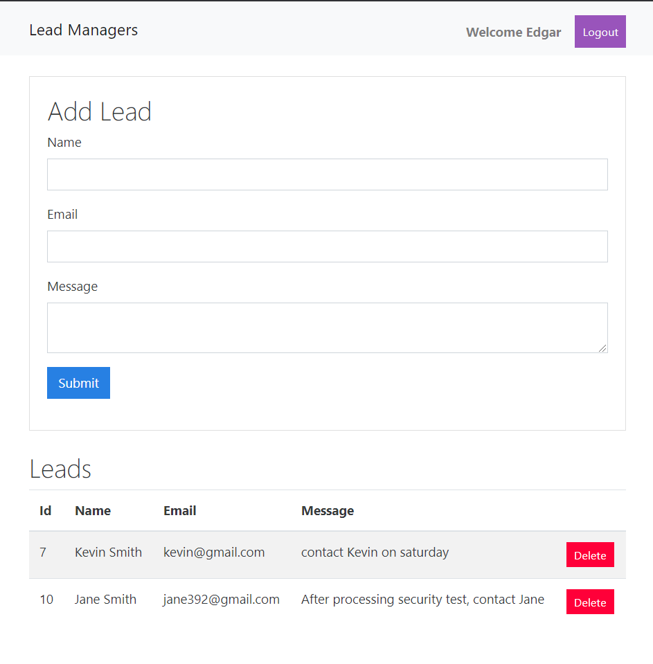

# React-Django-Collab

> A responsive Single Page Application(SPA) using React & Django

> An internal message applicaion for a company

> Co-developed with <a href="https://github.com/CESAR-JARAMILLO" title="CESAR-JARAMILLO" alt="https://github.com/CESAR-JARAMILLO">CESAR-JARAMILLO<a>

> Click <a href="#" target="_blank">`HERE`</a> to check it out right now.

## Preview

---

## Language

> Front-end

- Javascript
- React
- Redux
- Webpack
- Babel

> Back-end

- Python
- Django

> Database

- Sqlite

> Deployment

- Heroku

---

## Features

> User

- Sign in & Sign up & Log out
- Each individual has there own message box
- Alert popup
- Add message, Delete message

---

## Live Demo

> Click <a href="#" target="_blank">`HERE`</a> to check it out right now.

---
